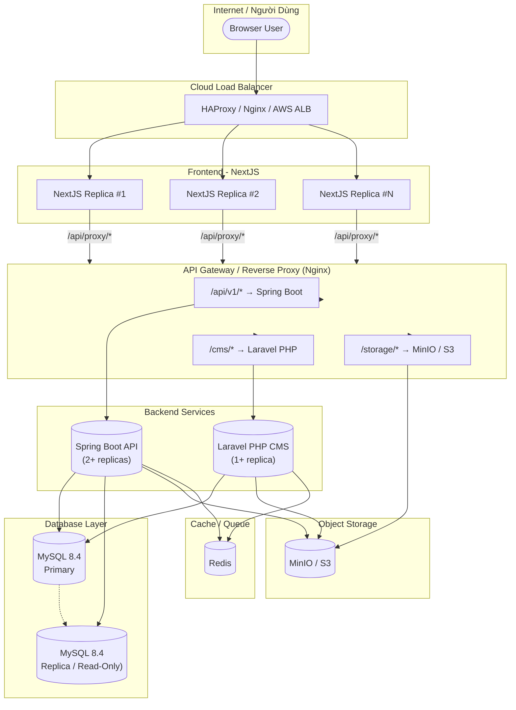
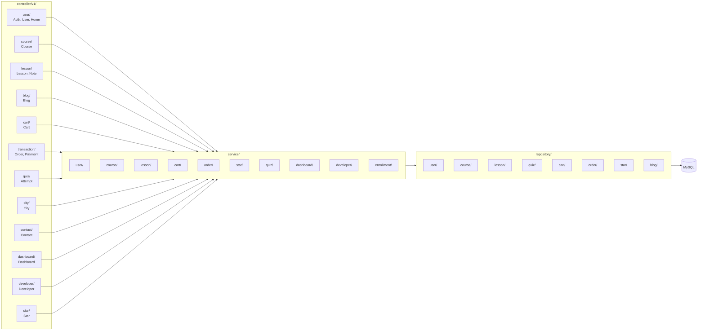
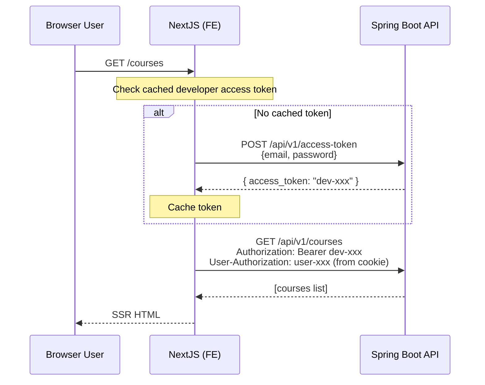
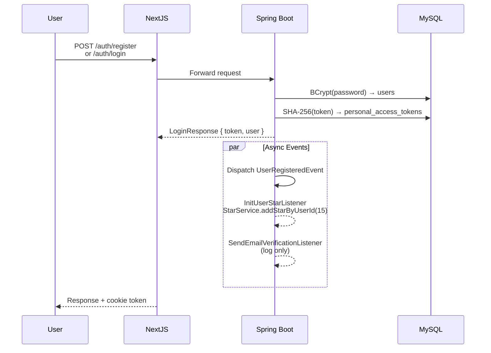
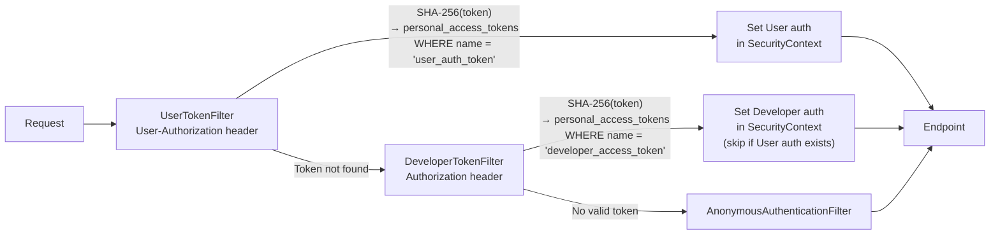
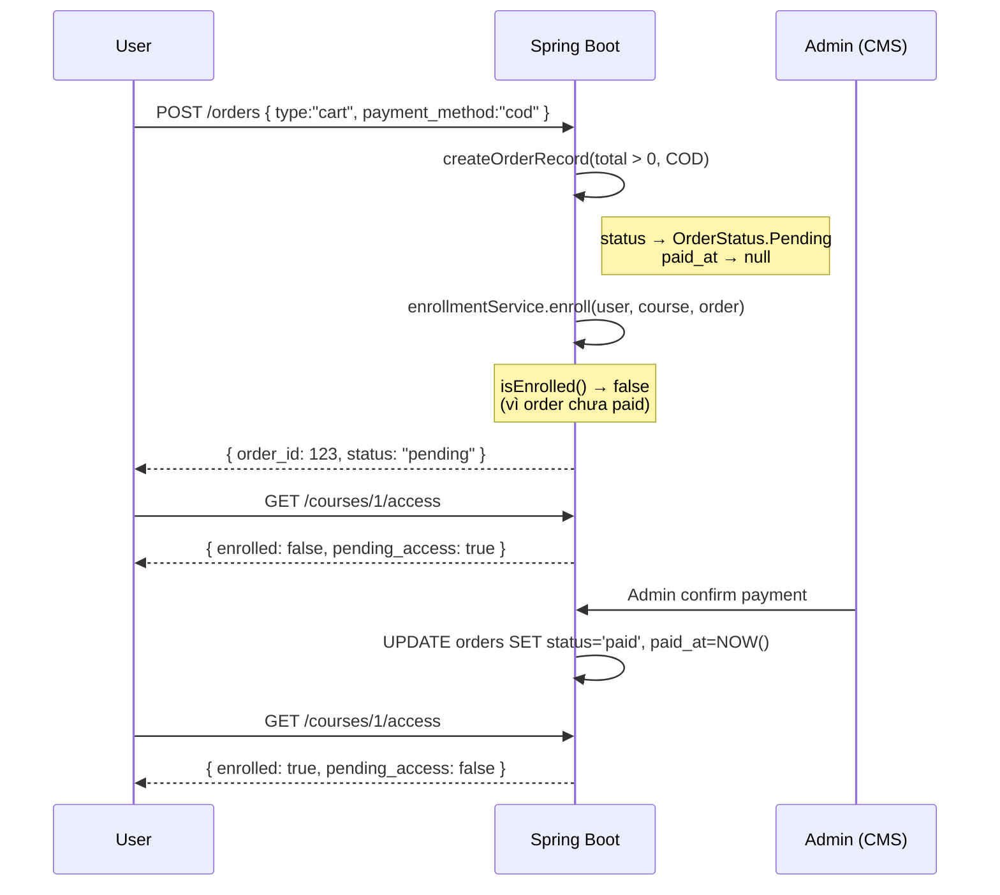
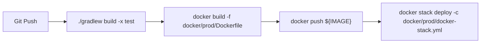

# Shining English API

Spring Boot REST API cho hệ thống Shining English — học tiếng Anh online.

---

## Kiến Trúc Tổng Quan



---

## Kiến Trúc Module (Spring Boot)



---

## Luồng Gọi API

### 1. Request từ Frontend (Proxy Flow)



### 2. Authentication Flow



### 3. Token Verification (Filter Chain)



### 4. Thanh Toán COD



---

## Deploy

### Development (Docker Compose)

```yaml
services:
  app:          # Spring Boot với hot-reload (port 8080)
  mysql:        # MySQL 8.4
```

```bash
docker compose up -d
docker compose logs -f app
```

### Production (Docker Swarm)

```yaml
# docker/prod/docker-stack.yml
services:
  app:
    image: ${DOCKER_REGISTRY}/${APP_NAME}:${APP_TAG}
    deploy:
      replicas: 2
      update_config:
        parallelism: 1
        order: start-first
      healthcheck:
        test: ["CMD", "curl", "-f", "http://localhost:8080/up"]
```

**CI/CD Pipeline:**



### Environment Variables

| Variable | Default | Description |
|---|---|---|
| `MYSQL_HOST` | `localhost` | MySQL host |
| `MYSQL_PORT` | `3306` | MySQL port |
| `MYSQL_DATABASE` | `shining_english` | Database name |
| `MYSQL_USER` | `shining` | DB user |
| `MYSQL_PASSWORD` | - | DB password |
| `JPA_DDL_AUTO` | `validate` | Hibernate DDL mode |
| `JPA_SHOW_SQL` | `false` | Log SQL queries |
| `APP_URL` | `http://localhost:8000` | App base URL (thumbnail) |
| `STAR_REGISTRATION_BONUS` | `15` | Star thưởng đăng ký |
| `STAR_DAILY_CHECKIN` | `1` | Star thưởng check-in |
| `STAR_COURSE_COMPLETE` | `10` | Star thưởng hoàn thành khóa |
| `RECAPTCHA_SECRET` | (empty) | Google reCAPTCHA secret |

---

## API Response Format

```json
{
  "message": "OK",
  "status": true,
  "status_code": 200,
  "data": { ... },
  "meta": {
    "page": 1,
    "per_page": 15,
    "total": 100,
    "page_count": 7
  }
}
```

- Success: `status: true`, HTTP status code
- Error: `status: false`, `message` mô tả lỗi
- Pagination: `meta` object trong response list
- Field names: **snake_case** (Jackson globally configured)

---

## Công Nghệ

| Component | Technology |
|---|---|
| Runtime | Java 21 (Temurin) |
| Framework | Spring Boot 4.1.0 / Spring Security 7.x |
| ORM | Spring Data JPA + Hibernate |
| Database | MySQL 8.4 |
| Migration | Flyway |
| API Doc | Springdoc OpenAPI 3.x (`/swagger-ui.html`) |
| Cache | (optional) Redis |
| Object Storage | MinIO / S3-compatible |
| Build | Gradle 9.x |
| Deploy | Docker + Docker Swarm |
| Monitoring | Health endpoint `GET /up` |
